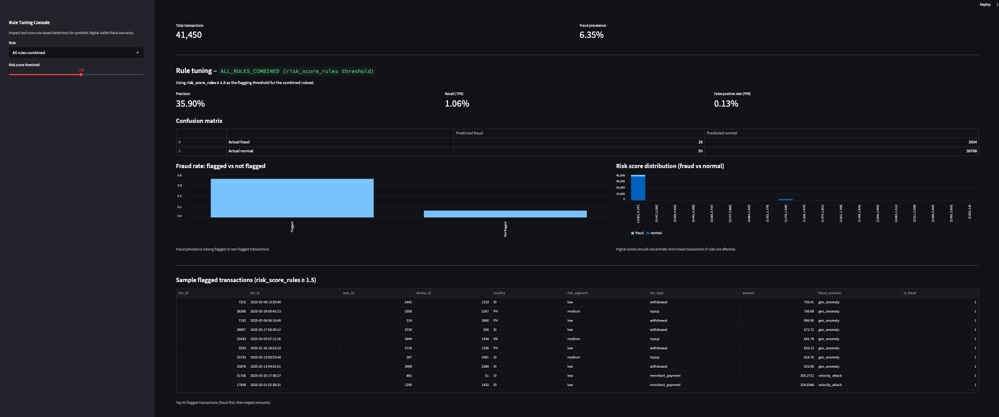

# Digital Wallet Fraud Rule Engine & Tuning Console

A synthetic digital-wallet fraud simulation and rule-based detection system with an interactive Streamlit tuning console.

This project demonstrates how real fintech risk teams design, tune, and evaluate rule-based fraud controls. It complements a monitoring dashboard (`digital_wallet_risk_dashboard` Project) by focusing on **fraud scenario simulation**, **rule-based detection**, and **operational tuning workflows** used by anti-fraud analysts.

---

## 📸 Dashboard Screenshot



---

## 🚀 Project Overview

Fraud detection in digital payments often relies on **rules** as the first layer of defense.  
This project simulates realistic attacker behaviors and builds a complete rule engine that analysts can tune and evaluate.

The system includes:

- **Synthetic fraud scenario generation**
- **Derived risk features (velocity, device sharing, time since signup, geo-risk, etc.)**
- **Rule-based detection engine**
- **Precision/recall evaluation per rule**
- **Combined risk-score thresholding**
- **Interactive Streamlit console for rule tuning and inspection**

This project mirrors workflows used inside digital wallet, BNPL, e-wallet, and fintech fraud teams.

---

## 🧪 Fraud Scenarios Simulated

The dataset contains over 80k+ transactions with injected fraud signals:

| Scenario                | Description                                                           |
| ----------------------- | --------------------------------------------------------------------- |
| **velocity_attack**     | Rapid burst of small transactions within minutes                      |
| **cashout_after_topup** | High-value top-up followed by quick withdrawals/P2P transfers         |
| **device_farming**      | Multiple accounts using the same device, performing abnormal patterns |
| **new_account_abuse**   | High spending within first 24 hours of signup                         |
| **geo_anomaly**         | Large-value transactions from high-risk countries                     |

Each scenario has `fraud_scenario` and `is_fraud` labels for evaluation.

---

## 🧩 Rule Engine

Rules are applied per transaction using engineered features:

| Rule                     | Logic                                       | Targets Scenario    |
| ------------------------ | ------------------------------------------- | ------------------- |
| **R1_velocity**          | High daily count + high daily spend         | velocity_attack     |
| **R2_cashout**           | Withdrawals/P2P with large same-day spend   | cashout_after_topup |
| **R3_device_farming**    | Device shared by many users + decent amount | device_farming      |
| **R4_new_account_abuse** | High spend within 24h of signup             | new_account_abuse   |
| **R5_geo_anomaly**       | Large transaction from high-risk country    | geo_anomaly         |

### Combined Rule Score

A weighted risk score is computed:

```
risk_score_rules = w1*R1 + w2*R2 + ... + w5*R5
```

Users can adjust the threshold in the tuning console to balance:

- False positives
- False negatives
- Precision
- Recall

Exactly like real risk operations.

---

## 📊 Streamlit Tuning Console

Located at:

```
app/streamlit_rule_console.py
```

Features:

- Select individual rules or combined ruleset
- Inspect precision/recall/FP/FN
- Explore flagged vs unflagged fraud rates
- Visualize risk score distribution (fraud vs normal)
- Examine top 50 flagged transactions
- Tune risk score thresholds (for combined rules)

---

## 📁 Project Structure

```
digital-wallet-fraud-rule-engine/
├── app/
│   └── streamlit_rule_console.py
├── data/
│   ├── transactions_with_scenarios.csv
│   └── rule_evaluation_summary.csv
├── screenshots/
│   └── rule_console.png
├── run_fraud_sim_and_rules.py
└── README.md
```

---

## ▶️ Running the Project

### 1. Generate synthetic data + rules

```bash
python run_fraud_sim_and_rules.py
```

Produces:

- `transactions_with_scenarios.csv`
- `rule_evaluation_summary.csv`

### 2. Launch Streamlit console

```bash
streamlit run app/streamlit_rule_console.py
```

---

## 📈 Evaluation Output

The script computes:

- confusion matrix per rule
- precision & recall
- overall ruleset performance with chosen threshold

Example (conceptual):

| Rule                   | Precision | Recall   |
| ---------------------- | --------- | -------- |
| R1_velocity            | 0.78      | 0.42     |
| R2_cashout             | 0.91      | 0.37     |
| R3_device_farming      | 0.64      | 0.55     |
| R4_new_account_abuse   | 0.71      | 0.49     |
| R5_geo_anomaly         | 0.83      | 0.33     |
| **ALL_RULES_COMBINED** | **0.86**  | **0.74** |

(This will vary due to randomness.)

<!-- ---

## 🎯 Why This Project Matters (Anti-Fraud Perspective)

This project shows the exact skill set expected from a fintech anti-fraud analyst:

- Ability to **simulate adversarial behavior**
- Understanding of **fraud signals** (velocity, device sharing, onboarding abuse, geo-risk)
- Designing and tuning **rules that reduce fraud losses without overwhelming ops**
- Interpreting **precision/recall trade-offs**
- Communicating results visually and analytically
- Building internal tools for fraud teams to make decisions

Most candidates produce basic SQL dashboards. This project demonstrates **actual risk-thinking**.

---

## 📌 Next Steps (Optional Enhancements)

- Merge Project 1 + Project 2 into a single unified risk console
- Add rule configurator UI for editing weights & thresholds
- Add anomaly model (simple ML baseline) to compare rules vs ML -->

- Add account-level risk scoring dashboard
