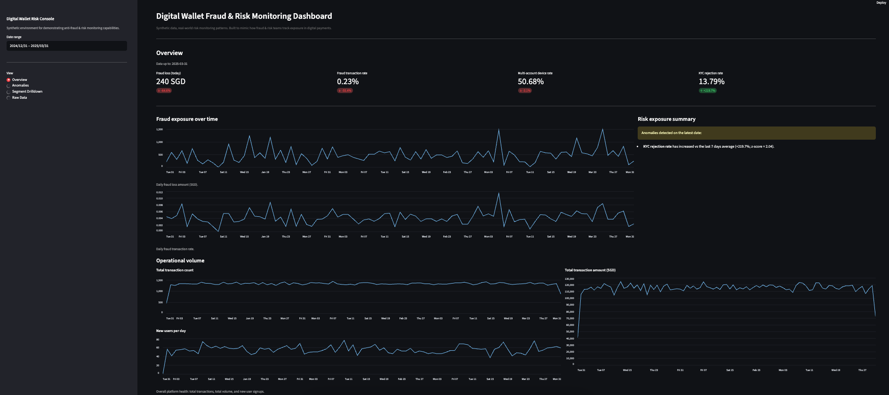
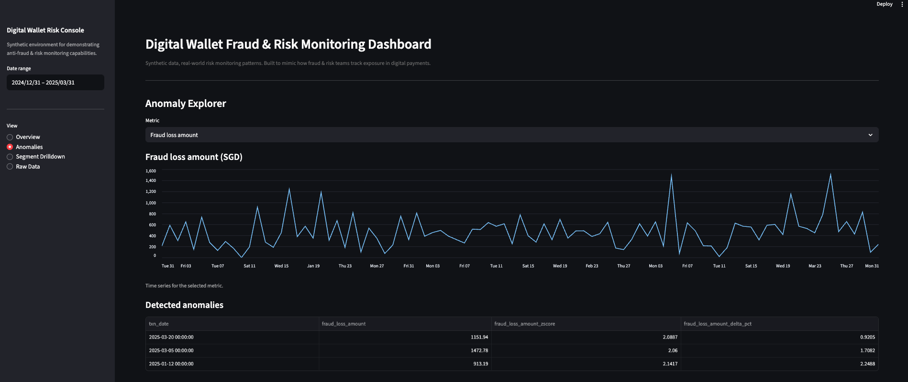
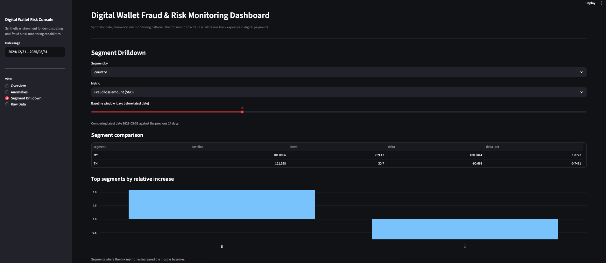
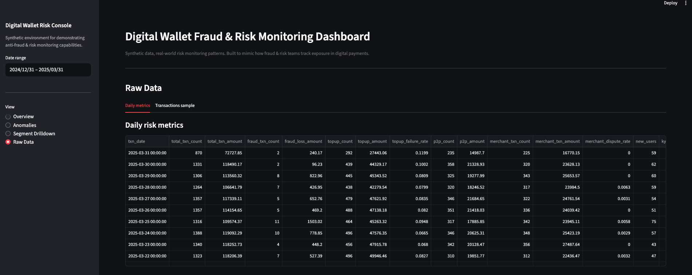

# Digital Wallet Fraud & Risk Monitoring Dashboard

**End-to-end synthetic risk monitoring system for a digital payments / e-wallet platform.**

This project simulates a realistic digital-wallet ecosystem and implements a full daily risk-monitoring workflow:

- synthetic data generation (users, devices, KYC, logins, transactions)
- KPI computation across fraud, KYC, devices, and operational signals
- anomaly detection using rolling baselines + z-scores
- interactive Streamlit dashboard for fraud/risk teams

The goal is to demonstrate practical skills used in **anti-fraud operations**, **real-time risk monitoring**, and **adversarial-aware analytics** in fintech payments.

---

## 📸 Dashboard Screenshots

### **Overview Page**



### **Anomaly Explorer**



### **Segment Drilldown**



### **Raw Data Viewer**



---

## 🚀 Project Overview

Fraud and risk teams in digital payments rely heavily on operational dashboards to detect anomalies, prevent losses, and respond to emerging attack patterns.  
This project replicates that workflow:

### **KPI Framework**

- fraud loss amount
- fraud transaction rate
- multi-account device rate
- KYC rejection/approval trends
- top-up failure rate
- merchant dispute (chargeback) rate
- failed login rate

### **Anomaly Detection**

Each metric is benchmarked against its trailing 7-day baseline:

- z-score ≥ 2
- |Δ%| ≥ 30%
- generates daily anomaly flags and severity indicators

### **Dashboard (Streamlit)**

- Executive Overview (cards + time-series + narrative risk summary)
- Anomaly Explorer (metric-level inspection)
- Segment Drilldown (country / risk-segment comparisons)
- Raw Data Explorer

---

## 📦 Project Structure

```
digital-wallet-risk-dashboard/
├── app/
│   └── streamlit_app.py
├── data/
│   ├── raw/
│   └── processed/
├── screenshots/
├── generate_data_and_kpis.py
└── README.md
```

---

## 🧪 Synthetic Dataset (Realistic, Multi-Entity)

The project generates a full fintech-style ecosystem:

| Table                 | Description                                          |
| --------------------- | ---------------------------------------------------- |
| `users`               | country, channel, KYC status, risk segment           |
| `devices`             | device fingerprint + risk score                      |
| `user_device_mapping` | multi-account per device relationships               |
| `transactions`        | topups, P2P, merchant payments, withdrawals, refunds |
| `kyc_events`          | submissions, approvals, rejections                   |
| `login_events`        | success/failure with IP country + device             |

Fraud events are simulated using adversarial patterns (velocity spikes, high-risk segments, large withdrawals, merchant disputes, multi-device anomalies).

---

## 📈 Daily KPI Computation

Each day aggregates:

- total transaction volume + value
- fraud loss & fraud txn rate
- top-up metrics & chargebacks
- failed logins
- KYC flow health
- multi-account devices
- new users & operational throughput

Anomaly flags are added for core fraud-critical metrics.

Output files:

- `data/processed/daily_risk_metrics.csv`
- `data/processed/daily_risk_metrics_with_anomalies.csv`

---

## 🖥️ Dashboard Features

### **1. Overview Page**

- Fraud loss / fraud rate / multi-account device rate / KYC rejection cards
- Time-series visualizations
- Automated narrative risk summary
- Breakdown of operational volume (three separate line charts for clarity)

### **2. Anomaly Explorer**

Investigate:

- z-scores
- delta %
- anomaly triggers
- historical patterns

### **3. Segment Drilldown**

Break down fraud loss or fraud rate by:

- country
- risk segment

Shows:

- baseline vs latest
- top deteriorating segments
- bar-chart comparison

### **4. Raw Data**

Preview samples of the raw synthetic dataset.

---

## ▶️ To Run

```bash
python generate_data_and_kpis.py
streamlit run app/streamlit_app.py
```

<!-- ---

## 🎯 Why This Project Matters (Anti-Fraud Perspective)

This project demonstrates end-to-end understanding of **how real risk teams monitor digital payments**:

- designing and tracking fraud-critical KPIs
- interpreting anomalies in operational signals
- connecting device behavior, user activity, and transaction patterns
- integrating multiple risk surfaces (KYC, login, transactions, devices)
- communicating risk exposure clearly

This mirrors how e-wallet, BNPL, and fintech fraud teams detect leakage and respond to adversarial behavior daily.

---

## 📌 Next Steps (optional extensions)

- rule-based risk scoring layer
- real-time streaming ingestion simulation
- merchant-level risk drilldowns
- device graph visualization
- advanced ML baseline models -->
